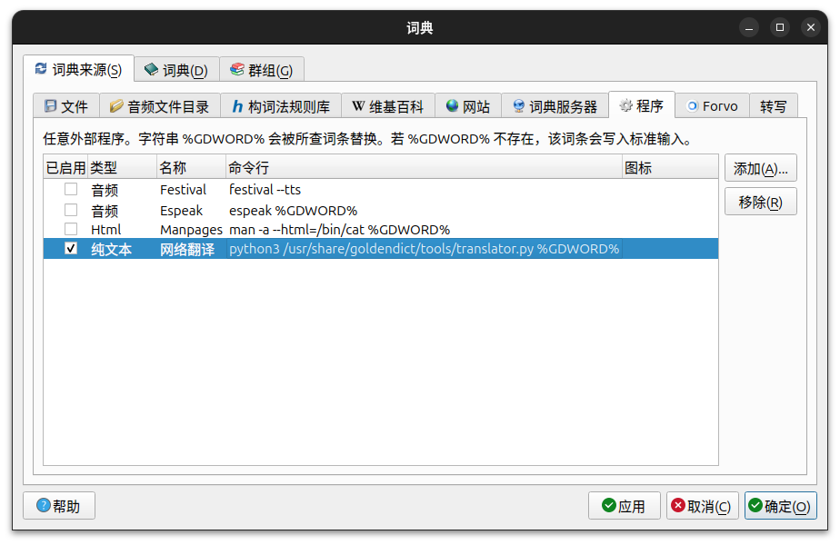

# Translator

命令行聚合翻译工具，主要作为GoldenDict翻译扩展，采用google和baidu翻译引擎，自动识别代理情况无缝切换

此为在原项目 https://github.com/skywind3000/translator 基础上做出的改动，在此感谢

## Preface

命令行翻译工具，主要用于搭配 GoldenDict，特性如下：

- 支持代理：自动检查系统代理，在 google 和 baidu 翻译引擎间无缝切换，无需手动环境调整
- 翻译引擎：精简翻译引擎，只使用 google 页面爬虫和 baidu 的官方接口，满足大部分需求
- 中英文主语言识别：在不指定源/目标语言的情况下，默认采用中英文翻译，自动分析源/目标语言

## Requirements

Python 3.5+ 以及 requests 库：

```bash
pip install requests
```

Ubuntu24.04限制pip进行扩展包安装，可以使用：

```bash
sudo apt-get install python3-requests
```

## Configuration

配置文件应位于 `~/.config/translator/config.ini`，内容类似：

```ini
# 本机处理相关设置：代理、请求超时界限、自动识别源语言字符阈值
[default]
proxy = 127.0.0.1:7890
timeout = 10
main_language_threshold = 0.7

# 谷歌翻译
[google]
host = translate.google.com

# 百度翻译：默认实现需要自行申请 appid/key
[baidu]
appid = xxxxx
key = xxxxx

```

## Usage

命令行格式

```bash
python translator.py [--from=语言] [--to=语言] {文字}
```

测试：

```bash
python translator.py 今天早上Mike推荐了我看DesiringClick上面一篇关于ColorSpace的文章
```

输出：

```
今天早上Mike推荐了我看DesiringClick上面一篇关于ColorSpace的文章
This morning Mike recommended me to read an article about ColorSpace on DesiringClick.
-----------------------------------
 * This morning Mike recommended me to read DesiringClick’s article about ColorSpace.
```


## Engines

可以使用下面引擎

| 引擎名称 | 网址 | 标准接口 | 国内直连 | 需要 Key 吗 | 计费 |
|---------|--------|--|--|--|--|
| google | https://translate.google.com/ | Yes | **No** | No | 免费 |
| baidu | [百度翻译开放平台 (baidu.com)](https://fanyi-api.baidu.com/api/trans/) | Yes | Yes | **Yes** | 高级版免费用量100万字符/月 |

说明：

- google 翻译利用 config.ini 里的 host，采取爬虫方法，给出的翻译结果更详细
- baidu 翻译需要 APPID/KEY ，虽然初次使用麻烦，但是是官方标准 API，稳定性上超过其他

## Tips

### 通用配置说明

通用配置在 config.ini 中 [default] 下，包括：

- `proxy` 本机代理使用的IP和端口号
- `connection_timeout` 单次请求最大等待时长
- `main_language_threshold` 主语言字符占比阈值，自动分析主语言时，某一语言（中/英）字符在段落中占比超过阈值时认为该语言为主语言

### 密钥申请

- 百度：到 [百度翻译开放平台](http://api.fanyi.baidu.com/api/trans/product/index)，申请开通

### 词典集成

要集成 GoldenDict，先在命令行下测试 Python 可以顺利运行该脚本，然后在GoldenDict中进行设置：
```bash
python3 <dir>/translator.py %GDWORD%
```


